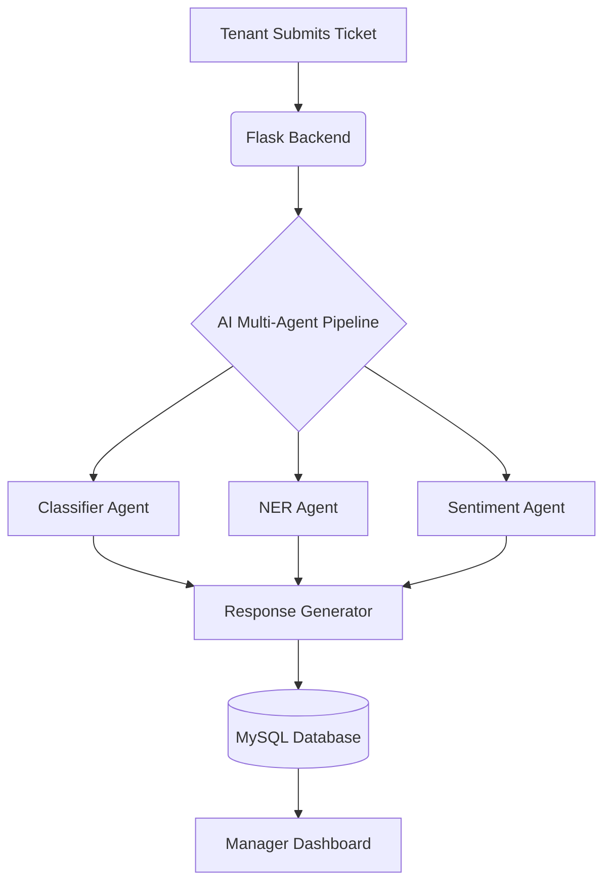

# 🏢 AI-Powered Real Estate Triage System
### Automated Tenant Support & Management Dashboard

    

## 📖 Executive Summary
Property management involves handling high volumes of tenant communication ranging from maintenance emergencies to lease inquiries. Manual processing is often inefficient and prone to delays.

The **AI-Powered Real Estate Triage System** is a Multi-Agent application designed to automate the classification, analysis, and response drafting for tenant support tickets. By leveraging **Large Language Models (LLMs)** via Groq, the system analyzes incoming requests in real-time to prioritize urgency, extract critical data points, and assist property managers in resolving issues faster.

---

## 🚀 Key Features

### 🤖 Intelligent Multi-Agent Pipeline
The core logic utilizes a chain of specialized AI agents to process raw text:
*   **Classifier Agent:** Categorizes tickets (e.g., Maintenance, Billing, Inquiry) and assigns urgency levels (Low/Medium/High).
*   **NER Agent (Named Entity Recognition):** Extracts structured data such as dates, monetary values, and unit numbers.
*   **Sentiment Agent:** Analyzes the emotional tone of the tenant (Positive, Neutral, Angry) to prioritize sensitive cases.
*   **Response Agent:** Generates context-aware, professional draft responses for manager approval.

### 📊 Manager Dashboard
A comprehensive command center for property managers:
*   **Real-time Metrics:** Overview of total, open, and high-priority tickets.
*   **Smart Filtering:** Sort by urgency, category, or sentiment.
*   **Ticket Resolution:** Review AI findings, edit draft responses, and close tickets with a single click.

### 🔐 Role-Based Access
*   **Tenant Portal:** Simplified interface for submitting requests.
*   **Manager Portal:** Full administrative access to the triage dashboard.

---

## 🏗️ System Architecture

The application follows a modular architecture separating the AI logic, web server, and persistence layer.



---

## 🛠️ Tech Stack

| Component | Technology | Description |
| :--- | :--- | :--- |
| **Backend** | Python 3.x, Flask | Lightweight web server and API routing. |
| **Database** | MySQL | Relational database for ticket and user storage. |
| **AI / LLM** | LangChain, Groq API | Framework for LLM orchestration using **Llama-3**. |
| **Frontend** | HTML5, Bootstrap 5 | Responsive, modern UI with FontAwesome icons. |

---

## 📂 Project Structure

```text
real-estate-triage/
│
├── app.py                     # Application entry point & route definitions
├── .env                       # Environment configuration (API Keys, DB Creds)
│
├── agents/                    # AI Logic Layer
│   ├── classifier.py          # Intent classification & urgency scoring
│   ├── ner.py                 # Entity extraction (Dates, amounts, units)
│   └── extras.py              # Sentiment analysis & summarization
│
├── database/                  # Persistence Layer
│   ├── db.py                  # Database connection logic
│   └── schema.sql             # SQL initialization script
│
├── templates/                 # Frontend Views (Jinja2)
│   ├── dashboard.html         # Manager control panel
│   ├── ticket_detail.html     # Deep dive view with AI insights
│   ├── submit_ticket.html     # Tenant submission form
│   └── login.html             # Authentication page
│
└── static/
    └── css/
        └── style.css          # Custom styling
```

---

## ⚙️ Installation & Setup

### Prerequisites
*   Python 3.8+
*   MySQL Server
*   Groq API Key (for LLM inference)

### 1. Clone the Repository
```bash
git clone <your-repo-link>
cd real-estate-triage
```

### 2. Install Dependencies
```bash
pip install -r requirements.txt
```
*If `requirements.txt` is missing, install manually:*
```bash
pip install flask mysql-connector-python langchain langchain-groq python-dotenv
```

### 3. Configure Environment
Create a `.env` file in the root directory:
```env
DB_HOST=localhost
DB_USER=root
DB_PASSWORD=your_password
DB_NAME=real_estate_triage
GROQ_API_KEY=gsk_your_actual_api_key_here
```

### 4. Initialize Database
Log into your MySQL instance and run the schema script:
```sql
SOURCE database/schema.sql;
```

### 5. Run the Application
```bash
python app.py
```
Access the application at: `http://127.0.0.1:5000`

---

## 🔑 Demo Credentials

For MVP demonstration purposes, simple authentication is implemented.

| Role | Username | Password | Access Level |
| :--- | :--- | :--- | :--- |
| **Manager** | `admin` | `1234` | Full Dashboard & Resolution |
| **Tenant** | `tenant` | `1234` | Ticket Submission Only |

---

## 🔮 Future Roadmap

*   **Security:** Implementation of bcrypt password hashing and CSRF protection.
*   **Notifications:** Email integration (SMTP) to notify tenants of ticket updates.
*   **Vector Database:** Integration (e.g., Pinecone/Chroma) to retrieve lease documents for context-aware answers.
*   **Containerization:** Docker support for easy deployment.
*   **Frontend Framework:** Migration to React.js or Vue.js for a more dynamic UI.

---

## 👨‍💻 **Context:** Final Year Project – 2026

